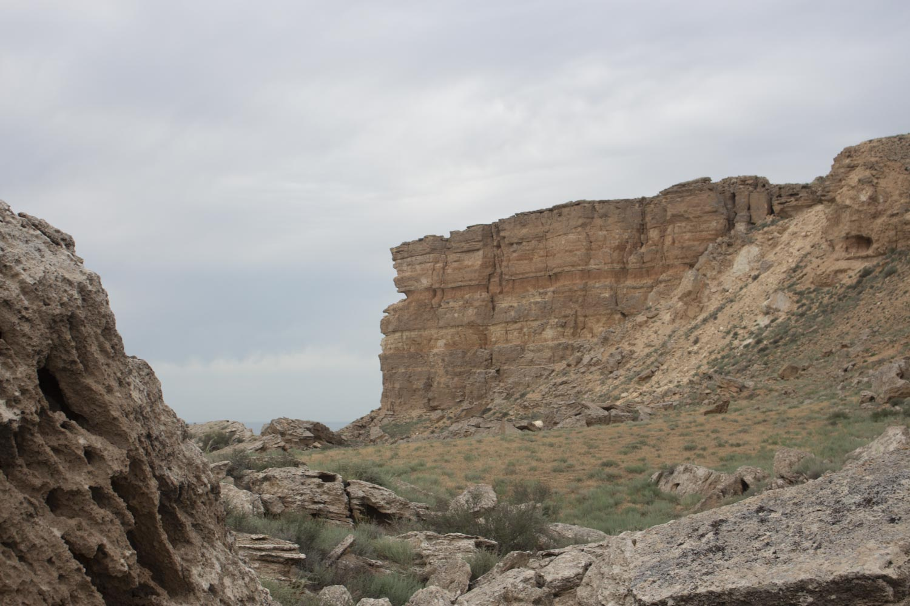

# Провал Жыгылган

*📷 Автор фото: Участники экспедиции DADA School*  
*📍 Координаты: 43.50000, 54.20000*  
*📆 Дата съёмки: 2024*  
*👤 Автор-составитель: Hedgenious*

## Что такое Жыгылган?

Жыгылган (каз. *Жығылған* — "упавший", "упавшая земля") — уникальная природная впадина, образовавшаяся в результате провала земной поверхности в Мангистауской области Казахстана. Этот процесс связан с растворением подземными водами известняковых пород, что привело к образованию обширных пещер и полостей. Со временем своды этих полостей обрушились, создав современный облик Жыгылган. Это впечатляющее геологическое образование площадью около 9 квадратных километров представляет собой один из самых крупных карстовых провалов в регионе и является ярким примером активных геологических процессов на полуострове Мангистау.

### Гипотеза о некарстовом происхождении

Существует также гипотеза, что провал Жыгылган мог образоваться в результате тектонических движений, которые вызвали обрушение земной коры. В этом случае провал мог быть вызван не только карстовыми процессами, но и сейсмической активностью, что делает его изучение особенно интересным для геологов.

## Географическое положение

Провал Жыгылган находится:
- На полуострове Мангистау
- В Мангистауском районе Мангистауской области
- В пределах плато Устюрт
- На территории древнего морского бассейна

## Геологические особенности

Жыгылган представляет собой уникальное геологическое образование:

- **Площадь провала** — около 9 квадратных километров
- **Глубина** — до 50-80 метров
- **Возраст образования** — предположительно несколько тысяч лет
- **Тип** — карстовый провал, образованный обрушением подземных полостей

Провал образовался в результате растворения известняковых пород подземными водами, что привело к формированию обширных пещер и полостей. Когда свод таких полостей не выдержал нагрузки, произошло обрушение, создавшее современный облик Жыгылган.

**Знаешь ли ты?**
Название "Жыгылган" буквально переводится как "упавший", что точно отражает процесс образования этого удивительного места — внезапного провала земной поверхности.

## Климат

Климат в районе провала Жыгылган резко континентальный:

- **Лето** — жаркое и сухое, температура достигает +45°C
- **Зима** — холодная, с температурами до -25°C
- **Осадки** — крайне редкие, менее 150 мм в год
- **Ветры** — сильные и частые, особенно в зимний период

## Растительный мир

Растительность провала Жыгылган разнообразна по сравнению с окружающими территориями:

- **Полынь** — различные засухоустойчивые виды на склонах
- **Солянки** — растения, адаптированные к засоленным почвам
- **Эфемеры** — весенние растения с коротким циклом развития
- **Галофиты** — растения дна провала, приспособленные к повышенной влажности

*Интересный факт: на дне провала, где скапливается влага, растительность более густая и разнообразная, чем на окружающих плато.*

## Животный мир

Фауна провала Жыгылган представлена:

- **Млекопитающие:** джейран, корсак, заяц-толай, ушастый еж
- **Птицы:** степной орел, пустельга, жаворонки, каменки
- **Пресмыкающиеся:** степная агама, песчаный удавчик, среднеазиатская черепаха
- **Беспозвоночные:** скорпионы, фаланги, жуки-чернотелки

Провал служит своеобразным убежищем для животных, особенно в жаркое время года, когда на дне сохраняется относительная прохлада.

## Природоохранная ценность

Жыгылган имеет высокую природоохранную ценность:

- Является уникальным геологическим памятником природы
- Демонстрирует активные карстовые процессы региона
- Служит рефугиумом для растений и животных
- Представляет научную ценность для изучения геологических процессов

## Культурное и историческое значение

Жыгылган имеет особое значение в культуре региона:

- Связан с многочисленными легендами о "провалившейся земле"
- Считается священным местом у местного населения
- Служил ориентиром для кочевников и караванов
- Упоминается в устном народном творчестве казахов

Согласно одной из легенд, провал образовался внезапно, поглотив целое поселение, что объясняет его название и мистический ореол.

## Как добраться и что посмотреть?

Поездка к провалу Жыгылган требует подготовки:

1. Наиболее удобный маршрут начинается из города Актау
2. Необходим внедорожник и желательно сопровождение местного гида
3. Дорога занимает около 3-4 часов в одну сторону
4. Лучшее время для посещения — весна и осень
5. Обязательно взять запас воды, продуктов и топлива

**Основные достопримечательности:**
- Сам провал с его впечатляющими размерами
- Панорамные виды с края провала
- Контраст растительности дна и склонов
- Геологические обнажения на стенах провала

**Попробуй сам!**
Сравни растительность на дне провала и на окружающем плато. Подумай, почему она отличается.

## Интересные факты

1. Жыгылган — один из крупнейших карстовых провалов в Казахстане.
2. Провал виден из космоса как темное пятно среди светлых пород плато.
3. На дне провала иногда скапливается дождевая вода, образуя временные озера.
4. Местные жители до сих пор считают провал мистическим местом.
5. Площадь провала (9 кв км) сопоставима с размером небольшого города.
6. Геологи предполагают, что подобные провалы могут образовываться и в других частях Мангистау.

## QR-коды для дополнительной информации

*Отсканируй этот QR-код, чтобы посмотреть видео о провале Жыгылган*

*Отсканируй этот QR-код, чтобы увидеть интерактивную карту провала Жыгылган с маршрутами и точками обзора*

## Источники информации

1. Казахская академия наук. Природа Мангистау и Устюрта. Алматы, 2014.
2. Медеу А. "Геологическое наследие Казахстана". Астана, 2012.
3. Путеводитель по Мангистау. Актау, 2021.
4. Архив Мангистауского областного историко-краеведческого музея.

## Теги

#местности #провал #Жыгылган #карст #геология #Мангистау #Мангышлак #Устюрт 
