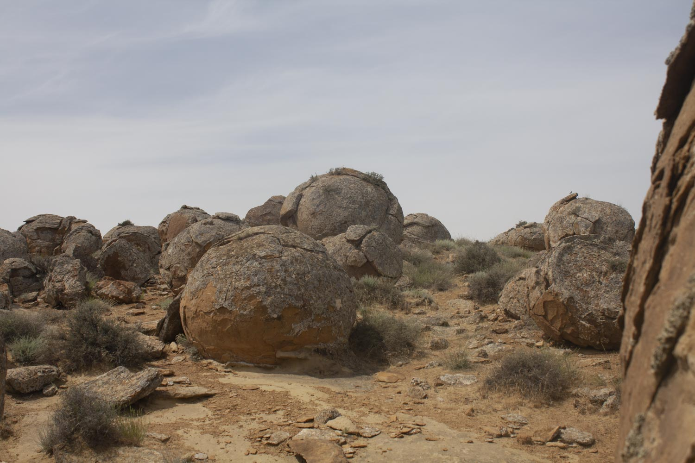

# Урочище Торыш (Долина шаров)

*📷 Автор фото: Участники экспедиции DADA School*  
*📍 Координаты: 44.36139, 51.56111*  
*📆 Дата съёмки: 2024*  
*👤 Автор-составитель: Hedgenious*

## Что такое Торыш?

Торыш (каз. *Торыш*) — уникальное урочище в Мангистауской области Казахстана, известное как «Долина шаров». Это место знаменито необычными конкрециями — каменными образованиями шаровидной формы, диаметр которых варьируется от 10–15 см до 4 метров. Эти загадочные шары привлекают туристов, фотографов и учёных со всего мира.

## Географическое положение

Урочище Торыш находится:
- На полуострове Мангышлак, в Мангистауском районе Мангистауской области
- Примерно в 150 км на север от города Актау
- На западной оконечности хребта Западный Каратау
- В 17,5 км на восток от села Таучик

## Геологические особенности

Торыш — это скопление конкреций, образовавшихся около 40–60 миллионов лет назад на дне древнего океана Тетис. Конкреции формировались в осадочных породах в результате минерализации вокруг органических остатков (например, раковин моллюсков). Процесс напоминает образование жемчуга, только в гораздо больших масштабах и с участием минеральных веществ.

- **Конкреции** — каменные шары, часто с концентрическими слоями
- **Возраст** — 40–60 млн лет (палеоген)
- **Состав** — песчаники, известняки, глины
- **Происхождение** — минерализация вокруг ядра (органика, раковины)

**Знаешь ли ты?**  
Слово «конкреция» происходит от латинского *concretio* — «срастание», а по-английски «concrete» означает «бетон».

## Климат

Климат в районе Торыша резко континентальный:

- **Лето** — жаркое и сухое, температура до +45°C
- **Зима** — холодная, до -20°C
- **Осадки** — крайне редкие, менее 150 мм в год
- **Ветры** — сильные, особенно зимой

## Растительный мир

Растительность Торыша скудная, типичная для полупустынь:

- **Полынь** — засухоустойчивые виды
- **Солянки** — растения, приспособленные к засоленным почвам
- **Эфемеры** — весенние растения с коротким циклом
- **Джузгун, саксаул** — кустарники, закрепляющие пески

*Интересный факт: весной после дождей среди каменных шаров можно увидеть цветущие растения, создающие необычный контраст.*

## Животный мир

Фауна урочища Торыш представлена:

- **Млекопитающие:** джейран, корсак, заяц-толай, ушастый еж
- **Птицы:** степной орел, пустельга, жаворонки, каменки
- **Пресмыкающиеся:** степная агама, песчаный удавчик, среднеазиатская черепаха
- **Беспозвоночные:** скорпионы, фаланги, жуки-чернотелки

## Природоохранная ценность

Торыш имеет высокую природоохранную ценность:

- Является уникальным геологическим памятником природы
- Служит местообитанием редких видов растений и животных
- Требует защиты от разрушения и сбора конкреций

## Культурное и историческое значение

Торыш — место, окутанное легендами:

- Считается сакральным у местных жителей
- Связан с преданиями о «каменных шарах»
- Служил ориентиром для кочевников и караванов

## Как добраться и что посмотреть?

Поездка в Торыш требует подготовки:

1. Наиболее удобный маршрут начинается из города Актау
2. Необходим внедорожник и желательно сопровождение местного гида
3. Дорога занимает около 3-4 часов в одну сторону
4. Лучшее время для посещения — весна и осень
5. Обязательно взять запас воды, продуктов и топлива

**Основные достопримечательности:**
- Долина шаров с конкрециями разных размеров
- Панорамные виды на окрестности
- Необычные формы конкреций
- Фотосессии среди каменных шаров

**Попробуй сам!**
Посчитай, сколько разных по размеру и форме шаров ты сможешь найти в Торыше. Придумай свою легенду о происхождении этих камней!

## Интересные факты

1. Конкреции Торыша — одни из крупнейших в мире.
2. Некоторые шары достигают 4 метров в диаметре.
3. По одной из легенд, каменные шары — это окаменевшие яйца древних животных.
4. Урочище часто называют «марсианским пейзажем» за его необычный вид.
5. В породах Торыша можно найти окаменелости древних морских организмов.

## QR-коды для дополнительной информации

*Отсканируй этот QR-код, чтобы посмотреть видео о Торыше*

*Отсканируй этот QR-код, чтобы увидеть интерактивную карту урочища Торыш с маршрутами и точками обзора*

## Источники информации

1. Казахская академия наук. Природа Мангистау. Алматы, 2014.
2. Медеу А. "Геологическое наследие Казахстана". Астана, 2012.
3. Путеводитель по Мангистау. Актау, 2021.
4. Архив Мангистауского областного историко-краеведческого музея.

## Теги

#местности #Торыш #Долина_шаров #конкреции #геология #Мангистау #Мангышлак
