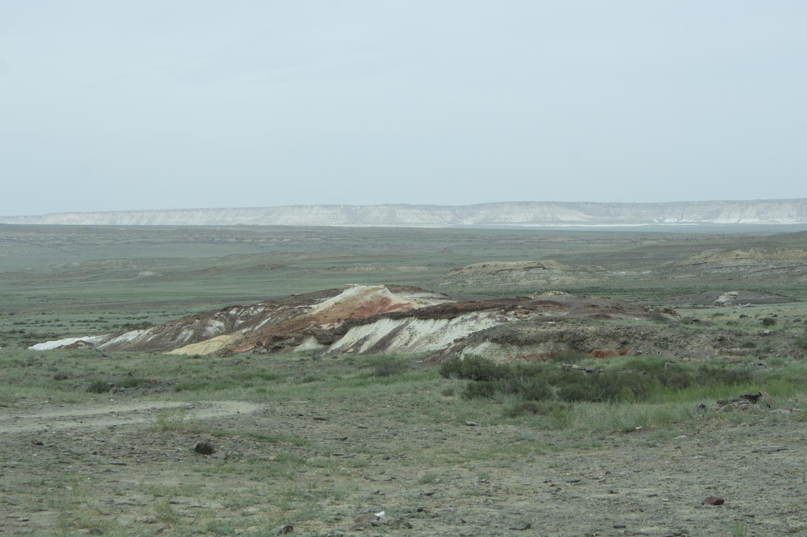

# Морские лилии (*Crinoidea fossilis*)

*📷 Автор фото: Участники экспедиции DADA School*  
*📍 Координаты: 43.40000, 54.10000*  
*📆 Дата съёмки: 2024*  
*👤 Автор-составитель: Hedgenious*

## Научная классификация

| Ранг таксона | Название на русском | Название на латинском |
|---|---|---|
| Царство | Животные | Animalia |
| Тип | Иглокожие | Echinodermata |
| Подтип | Прикрепленные | Pelmatozoa |
| Класс | Морские лилии | Crinoidea |
| Род | Ископаемые морские лилии | *Crinoidea* |
| Вид | Ископаемые морские лилии | *Crinoidea fossilis* |

## Охранный статус

**Статус МСОП:** Не оценивался (NE)

Ископаемые морские лилии являются палеонтологическими находками и не требуют охраны. Однако места их обнаружения могут нуждаться в защите от неконтролируемого сбора.

## Внешний вид

Ископаемые морские лилии имеют характерные особенности:
- **Размеры:** от нескольких сантиметров до 1 метра
- **Окраска:** обычно белая, серая или желтоватая из-за минерализации
- **Особенности:** 
  - Чашевидное тело (каликс)
  - Многочисленные членистые лучи
  - Стебельчатое основание
  - Сложная система пластинок

**Знаешь ли ты?**
Морские лилии — одни из древнейших животных на Земле, они появились более 500 миллионов лет назад!

## Ареал и местообитание

Ископаемые морские лилии встречаются в:
- Морских отложениях
- Карбонатных породах
- В Мангистау часто находят в меловых отложениях

Типичные места находок:
- Обрывы и овраги
- Карьеры
- Берега водоемов
- Оползневые участки

## Питание

Ископаемые морские лилии были фильтраторами:
- Мелкие планктонные организмы
- Органические частицы
- Микроскопические водоросли
- Бактерии

Питание происходило через фильтрацию воды лучами.

## Поведение

- **Активность:** прикрепленный образ жизни
- **Социальное поведение:** колониальное
- **Адаптации:** способность к регенерации
- **Особенности:** фильтрационное питание

*А ты бы смог найти окаменевшую морскую лилию среди других ископаемых?*

## Размножение

Ископаемые морские лилии размножались:
- Половым путем
- Выделением половых продуктов в воду
- Развитием через личиночную стадию
- Образованием новых колоний

## Продолжительность жизни

По ископаемым остаткам сложно определить продолжительность жизни, но современные морские лилии живут:
- От нескольких лет до десятилетий
- Некоторые виды могут жить более 100 лет

## Интересные факты

1. Морские лилии — единственные иглокожие, сохранившие прикрепленный образ жизни.
2. Их скелет состоит из множества мелких пластинок, соединенных мышцами.
3. В Мангистау находят морские лилии, жившие в древнем океане Тетис.
4. Некоторые виды могли открепляться от субстрата и плавать.
5. Морские лилии пережили несколько массовых вымираний.

**Попробуй сам!**
Попробуй найти окаменевшие морские лилии в меловых отложениях. Обрати внимание на сохранность их лучей и чашечки.

## Источники информации

1. Ausich W.I. Crinoid Form and Function. In: Echinoderm Studies. A.A. Balkema, 1997.
2. Hess H., Ausich W.I., Brett C.E., Simms M.J. Fossil Crinoids. Cambridge University Press, 1999.
3. Roux M. Les Crinoïdes pédonculés (Echinodermes) de l'Atlantique N.E.: systématique, écologie. Muséum national d'Histoire naturelle, 1977.

## Теги

#ископаемые #палеонтология #иглокожие #морские_лилии #меловые_отложения 
