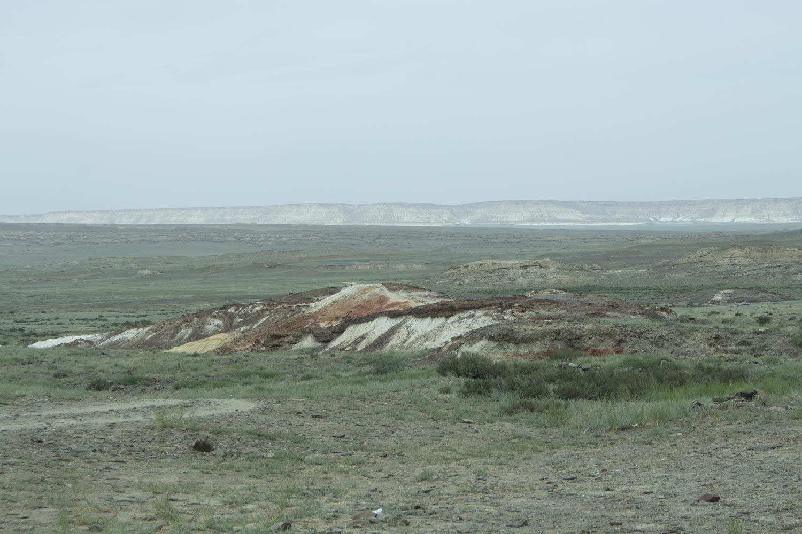

# Морские ежи (*Echinoidea fossilis*)

*📷 Автор фото: Участники экспедиции DaDa School*  
*📍 Координаты: 43.40000, 54.10000*  
*📆 Дата съёмки: 2024*  
*👤 Автор-составитель: Hedgenious*

## Научная классификация

| Ранг таксона |     Название на русском    | Название на латинском|
|---|---|---|
| Царство | Животные | Animalia |
| Тип | Иглокожие | Echinodermata |
| Подтип | Свободноживущие | Eleutherozoa |
| Класс | Морские ежи | Echinoidea |
| Род | Ископаемые морские ежи | *Echinoidea* |
| Вид | Ископаемые морские ежи | *Echinoidea fossilis* |

## Охранный статус

**Статус МСОП:** Не оценивался (NE)

Ископаемые морские ежи являются палеонтологическими находками и не требуют охраны. Однако места их обнаружения могут нуждаться в защите от неконтролируемого сбора.

## Внешний вид

Ископаемые морские ежи имеют характерные особенности:
- **Размеры:** от нескольких миллиметров до 30 см
- **Окраска:** обычно белая, серая или желтоватая из-за минерализации
- **Особенности:** 
  - Сферическая или уплощенная форма
  - Пятилучевая симметрия
  - Иглы различной длины
  - Сложная система пластинок

**Знаешь ли ты?**
Морские ежи появились более 450 миллионов лет назад и успешно пережили несколько массовых вымираний!

## Ареал и местообитание

Ископаемые морские ежи встречаются в:
- Морских отложениях
- Карбонатных породах
- В Мангистау часто находят в меловых отложениях

Типичные места находок:
- Обрывы и овраги
- Карьеры
- Берега водоемов
- Оползневые участки

## Питание

Ископаемые морские ежи были:
- Растительноядными
- Детритофагами
- Фильтраторами
- Хищниками (некоторые виды)

Питание происходило через специальный жевательный аппарат (аристотелев фонарь).

## Поведение

- **Активность:** донный образ жизни
- **Социальное поведение:** одиночное или групповое
- **Адаптации:** способность к регенерации
- **Особенности:** передвижение с помощью игл и амбулакральных ножек

*А ты бы смог определить, к какому типу питания относился найденный морской еж?*

## Размножение

Ископаемые морские ежи размножались:
- Половым путем
- Выделением половых продуктов в воду
- Развитием через личиночную стадию
- Образованием новых популяций

## Продолжительность жизни

По ископаемым остаткам сложно определить продолжительность жизни, но современные морские ежи живут:
- От нескольких лет до десятилетий
- Некоторые виды могут жить более 100 лет

## Интересные факты

1. Морские ежи имеют сложную систему внутренних органов, включая уникальный жевательный аппарат.
2. Их скелет состоит из множества мелких пластинок, соединенных мышцами.
3. В Мангистау находят морских ежей, живших в древнем океане Тетис.
4. Некоторые виды могли закапываться в песок или прикрепляться к скалам.
5. Морские ежи играли важную роль в формировании известковых отложений.

**Попробуй сам!**
Попробуй найти окаменевших морских ежей в меловых отложениях. Обрати внимание на сохранность их панциря и игл.

## Источники информации

1. Kier P.M. The Echinoids of the Middle Eocene Warley Hill Formation, Santee Limestone, and Castle Hayne Limestone of North and South Carolina. Smithsonian Institution Press, 1980.
2. Smith A.B. Echinoid Palaeobiology. George Allen & Unwin, 1984.
3. Durham J.W. Classification of clypeasteroid echinoids. University of California Publications in Geological Sciences, 1955.

## Теги

#ископаемые #палеонтология #иглокожие #морские_ежи #меловые_отложения 