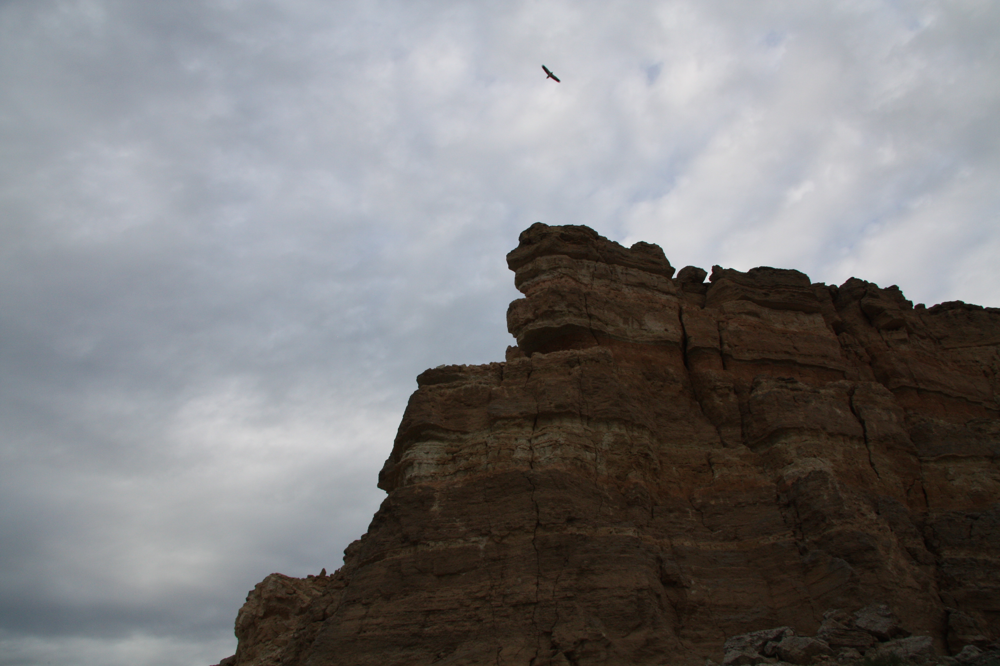

# Стервятник (*Neophron percnopterus*)

*📷 Автор фото: Участники экспедиции DADA School*  
*📍 Координаты: 43.50000, 54.20000 (Жыгылган)*  
*📆 Дата съёмки: 2024*  
*👤 Автор-составитель: Hedgenious*

## Научная классификация

| Ранг таксона | Название на русском | Название на латинском |
|---|---|---|
| Царство | Животные | Animalia |
| Тип | Хордовые | Chordata |
| Класс | Птицы | Aves |
| Отряд | Ястребообразные | Accipitriformes |
| Семейство | Ястребиные | Accipitridae |
| Род | Стервятники | *Neophron* |
| Вид | Стервятник | *Neophron percnopterus* |

## Охранный статус

**Статус МСОП:** Вымирающие виды (EN)

Стервятник находится под угрозой исчезновения из-за потери среды обитания, отравления пестицидами и другими ядами, а также преследования человеком. В Казахстане включен в Красную книгу как редкий вид с сокращающейся численностью.

## Внешний вид

Стервятник — самый мелкий из грифов Старого Света с характерным обликом:
- **Размеры:** длина тела 55-70 см, размах крыльев 155-170 см, вес 1,6-2,2 кг
- **Окраска:** взрослые особи белые с черными маховыми перьями, молодые — темно-бурые
- **Особенности:** 
  - Голая кожа лица желтого или оранжевого цвета
  - Клиновидный хвост (уникальный среди грифов)
  - Длинный тонкий клюв с крючком на конце
  - Хохолок перьев на затылке у взрослых птиц

**Знаешь ли ты?**
Несмотря на питание падалью, стервятник — очень чистоплотная птица. После еды он тщательно чистит перья и часто купается в воде!

## Ареал и местообитание

Стервятник обитает в засушливых регионах Южной Европы, Африки и Азии:
- Южная Европа (Пиренейский полуостров, Балканы)
- Северная и Восточная Африка
- Ближний Восток
- Аравийский полуостров
- Центральная Азия, включая Мангистау

Предпочитает следующие типы местообитаний:
- Пустынные и полупустынные местности
- Скалистые ущелья и горные обрывы
- Окрестности поселений человека
- Долины рек и каньоны

## Питание

Стервятник, вопреки своему названию, имеет разнообразное питание:
- Падаль и остатки добычи крупных хищников
- Мелкие позвоночные (ящерицы, грызуны)
- Насекомые и их личинки
- Яйца и птенцы других птиц
- Растительная пища (фрукты, злаки)

Уникальная особенность стервятника — использование камней для разбивания яиц страусов и других крупных птиц. Это один из немногих видов птиц, использующих орудия.

## Поведение

- **Активность:** дневная, особенно в утренние и вечерние часы
- **Социальное поведение:** гнездится отдельными парами, но может образовывать небольшие группы на местах кормежки
- **Коммуникация:** в основном молчалив, но может издавать шипящие и каркающие звуки
- **Терморегуляция:** в жару может разбрызгивать помет на ноги для охлаждения через испарение (рефлексивное охлаждение)

Стервятник — перелетная птица, зимующая в Африке и на Аравийском полуострове. Молодые птицы первые 3-4 года ведут кочевой образ жизни, прежде чем вернуться на родину для гнездования.

*А ты бы смог найти пищу в пустыне так же эффективно, как стервятник? Эти птицы обладают исключительным зрением и могут заметить падаль с высоты нескольких километров!*

## Размножение

- **Сезон размножения:** март-апрель
- **Гнездо:** строит на скальных выступах, в нишах и пещерах
- **Кладка:** 1-3 яйца (обычно 2) красноватого цвета с пятнами
- **Инкубация:** 42-45 дней, насиживают оба родителя
- **Птенцы:** остаются в гнезде около 90 дней, родители продолжают подкармливать их еще 1-2 месяца после вылета

Пары стервятников сохраняют верность друг другу на протяжении всей жизни и возвращаются к одному и тому же гнезду много лет подряд.

## Продолжительность жизни

В природе стервятник живет 15-20 лет, в неволе может достигать 30 лет.

## Интересные факты

1. Научное название Neophron происходит от имени мифического героя, который был превращен Зевсом в стервятника.
2. Стервятник почитался в Древнем Египте как священная птица и считался символом богини Нехбет.
3. Он способен разбивать яйца страусов, бросая камни на их скорлупу — пример использования орудий птицами.
4. Желтая окраска лица стервятника происходит от каротиноидов, получаемых из пищи.
5. В Испании стервятники научились окрашивать свои шеи и грудь в красный цвет, купаясь в почвах с высоким содержанием железа — возможно, это форма косметического улучшения внешности для привлечения партнеров.

**Попробуй сам!**
Изготовь модель стервятника, летящего над пустыней Мангистау. Используй бумагу, картон и краски, чтобы показать характерные особенности этой птицы и ее местообитание.

## Источники информации

1. Дементьев Г.П. Птицы Советского Союза. Москва, 1951.
2. Gavrilov E., Gavrilov A. The Birds of Kazakhstan. Almaty, 2005.
3. BirdLife International. Species factsheet: Neophron percnopterus. 2021.

## Теги

#животные #птицы #ястребообразные #хищные_птицы #падальщики #красная_книга 
