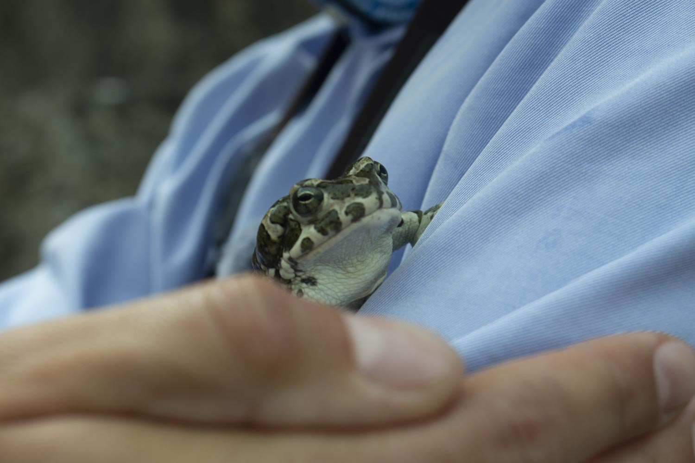

# Зелёная жаба (*Bufotes viridis*)

*📷 Автор фото: Участники экспедиции DaDa School*  
*📍 Координаты: 43.40000, 54.10000*  
*📆 Дата съёмки: 2024*  
*👤 Автор-составитель: Hedgenious*

## Научная классификация

| Ранг таксона |     Название на русском    | Название на латинском|
|---|---|---|
| Царство | Животные | Animalia |
| Тип | Хордовые | Chordata |
| Класс | Земноводные | Amphibia |
| Отряд | Бесхвостые | Anura |
| Семейство | Жабы | Bufonidae |
| Род | Зелёные жабы | *Bufotes* |
| Вид | Зелёная жаба | *Bufotes viridis* |

## Охранный статус

**Статус МСОП:** Вызывающие наименьшие опасения (LC)

Зеленая жаба имеет широкий ареал и относительно стабильную численность. Однако в некоторых регионах, включая Мангистау, численность может сокращаться из-за антропогенного воздействия и изменения климата.

## Внешний вид

Зеленая жаба — средних размеров земноводное с характерной пятнистой окраской:
- **Размеры:** длина тела 5-10 см, самки крупнее самцов
- **Окраска:** верхняя сторона тела серовато-зеленая с крупными темно-зелеными пятнами, брюшко светлое с темными пятнами
- **Особенности:** 
  - Кожа бугристая с многочисленными железами
  - Паратоидные железы хорошо развиты
  - Глаза с горизонтальными зрачками
  - Плавательные перепонки на задних лапах развиты слабо

**Знаешь ли ты?**
Зеленая жаба может менять интенсивность своей окраски в зависимости от температуры окружающей среды и времени суток!

## Ареал и местообитание

Зеленая жаба распространена в:
- Европе (кроме северных регионов)
- Северной Африке
- Западной и Центральной Азии
- В Казахстане встречается в южных регионах, включая Мангистау

Предпочитает следующие местообитания:
- Сухие степи и полупустыни
- Оазисы и берега водоемов
- Сады и огороды
- Окраины населенных пунктов

## Питание

Зеленая жаба — активный хищник:
- Насекомые (жуки, муравьи, кузнечики)
- Пауки и многоножки
- Моллюски
- Дождевые черви
- Мелкие позвоночные (ящерицы, мышата)

Охотится преимущественно ночью, используя липкий язык для захвата добычи.

## Поведение

- **Активность:** сумеречная и ночная
- **Социальное поведение:** одиночное, собирается группами только в период размножения
- **Коммуникация:** самцы издают громкие трели в брачный период
- **Адаптации:** хорошо переносит засуху, зарываясь в землю

*А ты бы смог прожить без воды несколько месяцев, как это делает зеленая жаба?*

## Размножение

- **Сезон размножения:** апрель-июнь
- **Нерест:** в стоячих или слабопроточных водоемах
- **Кладка:** шнуры икры длиной 1-2 метра
- **Развитие:** головастики развиваются 1-2 месяца
- **Метаморфоз:** молодые жабы выходят на сушу в июле-августе

## Продолжительность жизни

В природе зеленая жаба живет 5-10 лет, в неволе может достигать 15 лет.

## Интересные факты

1. Зеленая жаба может впадать в летнюю спячку при недостатке влаги.
2. Ядовитые выделения кожных желез защищают жабу от хищников.
3. В отличие от других жаб, зеленая жаба хорошо прыгает и может преодолевать значительные расстояния.
4. Самцы в брачный период могут менять окраску, становясь более яркими.
5. Головастики зеленой жабы могут развиваться в очень соленой воде.

**Попробуй сам!**
Понаблюдай за зелеными жабами в вечернее время. Запиши, как они охотятся и какую добычу предпочитают. Сделай зарисовки их характерных поз и движений.

## Источники информации

1. Кузьмин С.Л. Земноводные бывшего СССР. Москва, 2012.
2. Ананьева Н.Б. и др. Атлас пресмыкающихся Северной Евразии. Санкт-Петербург, 2004.
3. IUCN Red List of Threatened Species. Bufotes viridis. 2021.

## Теги

#животные #земноводные #бесхвостые #жабы #ксерофилы 